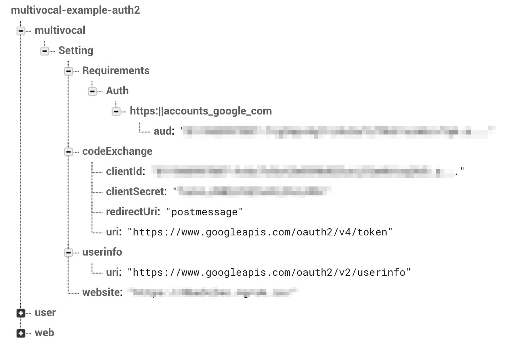
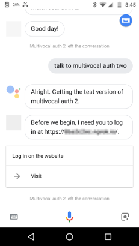
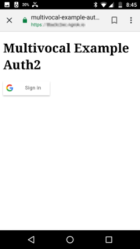
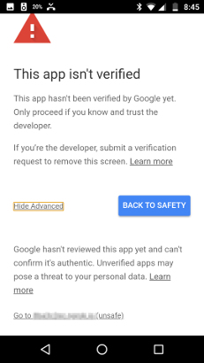
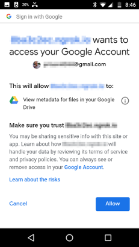
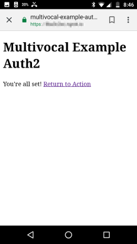
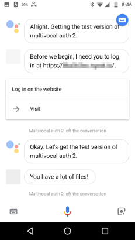

# multivocal-example-auth2

This project is a demonstration about how to use multivocal to do 
authentication and authorization with Actions on Google and Google Sign In.

If you've looked at the previous two examples (multivocal-example-auth0 and
multivocal-example-auth1), you'll see that this one is a lot more complicated.
It is trying to do more - both *authentication* **and** *authorization*. So
we both want to know who this user is and then get permission to do something
on their behalf (in this case, count how many files they have in Google Drive).

Users can't authorize you to access their account using voice alone. They will
need to be directed to a website where they will be able to authorize OAuth
scopes that your project needs. 

## Before you code

Before we begin coding, there is a lot of setup we'll need. (Much of this setup
is stuff we need if we were setting up Sign-In for a web page, so it may be
familiar, but we have a few more settings to deal with.)

### Prerequisites

* A project in the Action Console. This also gives us a project in the
  Google Cloud Console, which we'll be using. They must be the same project.
* We will use Firebase for Cloud Functions, the Real-Time Database, and
    for hosting the web page for sign-in.
    * Changes for Google Cloud Functions, AWS Lambda,
        or other node.js hosting platforms are possible, but are left as an
        exercise for the reader.
    * We're using the Firebase Real-Time Database to store user information.
        You can substitute another database or data store instead, but we're
        doing it this way because the integration is significantly easier.
    * Using something besides Firebase Hosting is also possible, but you may
        need to deal with cross-site restrictions.
* For this example, check the project out from github:
     `git clone https://github.com/afirstenberg/multivocal-example-auth2.git`

     
### Setup Actions on Google

### Setup Google Cloud API Credentials

### Setup Google Cloud API Library Access

### Setup Firebase Database

## Create a Login Web Page

Our user will need to login to our service via the web and grant us permission
to access some information in their Google Drive account. Since we will want
to do this through an Action without requiring them to login every time, we
request "offline access" which will give us both an *auth token*, which grants
us the access we want for a limited time, and a *refresh token*, which gives
us the ability to get new access tokens when the first has expired. We will
store these tokens in a Firebase database.

### public/index.html

We're going to use a fairly basic HTML file on our website, but won't go over
all the details of the page. While you can use
this page as a foundation, you'll probably want to dress it up to include
things such as your privacy policy (which Google requires). 

Before we get to the Javascript, let's skip to the bottom to look at the 
document body. We include three
blocks which will be shown or hidden based on where the user is during the 
login process.

```
  <body>
  <h1>Multivocal Example Auth2</h1>

  <div id="g-signin2" class="g-signin2"></div>
  <div id="working">Working...</div>
  <div id="link-action">You're all set! <a href="">Return to Action</a></div>

  </body>
```

The `g-signin2` area will contain the button that Google's code will add,
while the `working` and `link-action` blocks start out hidden, and will be
shown at various points in our code.

Speaking of our code - what is it doing, anyway?

We start out by loading JQuery (because it makes a few things a touch easier)
and some Firebase functions. We'll also use the automatic Firebase configuration
that we can load

```
    <script src="//ajax.googleapis.com/ajax/libs/jquery/1.8.2/jquery.min.js"></script>

    <script src="/__/firebase/5.1.0/firebase-app.js"></script>
    <script src="/__/firebase/5.1.0/firebase-database.js"></script>
    <script src="/__/firebase/init.js"></script>
```

Once these are loaded, the script starts out by loading the configuration
from the Firebase database and saving it to use at other points in the script.

```
      var database = firebase.database();
      var conf;
      database.ref('/web').once('value').then(function(snapshot){
        var config = snapshot.val();
        console.log('config',config);
        conf = config;

        // Set the link to the Action
        $('#link-action a').attr('href',conf.action.uri);

        return config;
```

Once the configuration has been loaded, it turns some of this configuration
into HTML <meta> tags.


### functions/authCode.js

### functions/datastore.js

### functions/index.js

### Firebase Database: web configuration

## Write and Configure the Action

This Action is different than our previous two auth examples. Since the purpose
is to access a Google resource with an auth token, there are a number of
additional tasks we'll need to take as part of the Action itself, but we'll
limit what it can do to just saying the answer and quitting.

Because it needs to get the auth, there are two paths it can take:

1. If we have logged in previously, it uses the ID Token to get the user's
    records, including their auth token, and uses this to make a call to
    Google Drive to get the information we want.
2. If we have not logged in previously, it directs us to the web page to do
    the login (that we setup above) and we're then directed back to the Action.

### functions/index.js

We've already had some lines in index.js to handle the web client processing
the one-time code, but now we'll add our standard lines to handle the Action
webhook. (As typical, most of the work will be done in `config.js`.)

```
const Multivocal = require('multivocal');

require('./config.js').init();

exports.webhook = Multivocal.processFirebaseWebhook;
```

### functions/config.js

Our configuration is a little different than previous auth examples, but
follows much of the same structure. As before, we won't be going through
all the details, but we will cover most of the components we find here and
why we have them in place.

Since all we're doing is returning one value, we'll be doing that as part of
our welcome intent. So our welcome intent will have the requirement that
`User/IsAuthenticated` must be set, as we've done before:

```
  "Intent.welcome": "User/IsAuthenticated"
```

Although `User/IsAuthenticated` is set when multivocal gets a valid identity
token, we want to use a different method to request it if not present. So we
will be creating what we call a "requirement request" function. In this case,
it doesn't need to do much - just set an internal name for what we're 
requesting (we're going to use "website", but it could be anything) and
then do other default tasks:

```
var requestRequirementsWebsite = function( env ){
  return Multivocal.requestDefault( env, 'website' );
};
```

We have to register this function as part of our `init()` function:

```
  Multivocal.setRequirementRequest( "User/IsAuthenticated", requestRequirementsWebsite );
```

One of the default tasks is to adjust what the `Action`, `Intent`, and `Outent`
environment settings are to reflect that we're requesting something - in this
case, we're requesting a "website" (our internal name above). (It also saves
this information in a context, so it re-attempts the welcome once we have the
information we want.) So we'll
be able to set a response configuration under `Local/en/Response`:

```
  "Request.website.Intent.welcome": [
    {
      ShouldClose: true,
      Template: {
        Ssml: "Before we begin, I need you to log in on the website.",
        Text: "Before we begin, I need you to log in at {{Config.Setting.website}}.",
        Option: {
          Type: "Carousel",
          Items: [
            {
              Body: "Log in on the website",
              Url: "{{Config.Setting.website}}"
            }
          ]
        }
      }
    }
  ],
```

This sends a message (the verbal one is slightly different than the one that
is displayed) and a card with a link to the website that the user should use
to login with.

Once the user has gone through the login on the website, or if they're returning
to us after previously authenticating themselves and authoring us to access
their Drive, we will have the user ID as part of their profile. In order to get
the values we need to give them an answer, we need to do a few things:
* Get their profile from our database, including their auth token
* Possibly refresh the token, if it has expired
* Load the values we want using Google Drive's API
And then we can call the default handler which will send the message and close
the conversation.

To do all this, we create a handler

```
var handleFileCount = function( env ){
  env.id = env.User.Profile.sub;
  return loadUser( env )
    .then( env => loadTokens( env ) )
    .then( env => loadFileCount( env ) )
    .then( env => Multivocal.handleDefault( env ) );
};
```

and register it

```
  Multivocal.addIntentHandler( "welcome", handleFileCount );
```

A few important things to note about the `handleFileCount()` function:
* As with most functions in multivocal, we treat it as asynchronous so we
    need to return a Promise that resolves to the environment (which is
    also passed in).
* The environment is always passed around and stores everything we want to
    remember.
* We break it down into small parts (which we'll look at in a moment).
* At the end, we call the default handler.

The `loadUser()` function is a wrapper around our Datastore library that
gets the user's profile from the Firebase database from the user's ID:

```
var Datastore = require('./datastore');

var loadUser = function( env ){
  return Datastore.getUser( env.id )
    .then( user => {
      env.user = user;
      return Promise.resolve( env );
    });
};
```

The `loadTokens()` function looks long, but does two things.

First, if the tokens are valid, it puts all the token info into an 
environment setting, `tokens`, and then returns the Promise with the
environment.

```
  var now = Date.now();
  if( env.user.tokens.expires_after > now ){
    env.tokens = env.user.tokens;
    return Promise.resolve( env );
  }
```    
    
If the auth token has expired, however, it needs to contact the code exchange
endpoint and use the refresh token to get a new auth token and save all the
token information in the datastore again (as well as saving it in the
environment) before returning a Promise with the environment.

```
  var settings = env.Config.Setting.codeExchange;

  var refreshToken = env.user.tokens.refresh_token;

  var body = {
    refresh_token: refreshToken,
    client_id:     settings.clientId,
    client_secret: settings.clientSecret,
    grant_type:    'refresh_token'
  };

  var options = {
    method: 'POST',
    uri:    settings.uri,
    form:   body,
    json:   true
  };

  return rp( options )
    .then( tokens => {
      tokens.refresh_token = refreshToken;
      env.tokens = tokens;
      return Datastore.saveUser( env.id, tokens );
    })
    .then( result => Promise.resolve( env ) );
``` 

Finally, the `loadFileCount()` functions calls the Drive API with the access
token. We'll request 100 files (the max allowed), but we don't need much
information about each, since we just want the count, which we store in the
`fileCount` environment. If it tells us there are
more files - we're not going to get them, we'll just set an environment field
called `tooManyFiles` to indicate we have a lot of them. 

```
  var accessToken = env.tokens.access_token;

  var options = {
    method: 'GET',
    uri: 'https://www.googleapis.com/drive/v3/files',
    headers: {
      Authorization: `Bearer ${accessToken}`
    },
    qs: {
      pageSize: 100,
      fields: 'kind,nextPageToken,files/id'
    },
    json: true
  };
  return rp( options )
    .then( result => {
      env.fileCount    = result.files.length;
      env.tooManyFiles = result.nextPageToken ? true : false;
      return Promise.resolve( env );
    });
```

This is a common
pattern - handle logic in code, where it makes sense to, and store the result
in the environment. We store everything in the environment, because it makes
it a lot easier when we go to send back the results using a template for the
welcome intent. That template always sets that we should close the connection
after we send the result. If there are too many files, we'll pick from a 
couple of messages that say so, and if not, we'll send back just one, making
sure we use either "file" or "files" as appropriate.

```
  "Intent.welcome": [
    {
      Base: {Set: true},
      ShouldClose: true
    },

    {
      Base: {Set: true},
      Criteria: "{{tooManyFiles}}"
    },
    "You have too many files for me to count.",
    "You have a lot of files!",

    {
      Base: {Set: true},
      Criteria: "{{not tooManyFiles}}"
    },
    "You have {{inflect fileCount 'file' 'files' true}} in Google Drive"
  ]
```

And, of course, we need to make sure the configuration object is set in
multivocal itself. We also make it so configuration can be loaded from the
Firebase database:

```
  new Multivocal.Config.Simple( config );
  new Multivocal.Config.Firebase();
```

### Firebase Database: multivocal configuration

You may have noticed that the configuration setting for the website URL isn't
in the `config.js` file itself. Instead, we include it as part of the
Firebase configuration. Unless otherwise configured the Firebase-based
configuration uses the structure underneath the `multivocal` top level entry.
In our case, we have everything under the `Setting` hierarchy, since everything
we're putting here is a setting



The `Requirements/Auth` path contains the same setting that we had in our
"auth1" example - the `aud` string that must match a particular `iss` domain.
However, Firebase db doesn't allow certain characters in a key - particularly
the period and forward slash (. and / respecitively), so we have to use an
underscore and vertical bar (_ and |) and multivocal's configuration changes
them when we read it in. This `aud` string comes from the Client ID we get from
setting up Account Linking in the Actions console. (If you're observant,
you'll also note that on the Cloud Console Credentials page, this same Client
ID is for the credentials named "New Actions on Google App".)

We use the `codeExchange` portion of the setting to contain information that
is used when we exchange a refresh token for a fresh auth token. This includes
the client ID and client secret that are associated with the Web Client, which
you can again find on the Cloud Console Credentials page. The `redirectUri`
and `uri` settings are pretty standard, but we include them as settings in case
we need to change them in the future.

The `uri` for `userinfo` is the same - this is a pretty standard URL, but we'll
make it configurable just in case.

Finally, the `website` needs to be our own website - we use this in the
template we have in `config.js` to direct users to log in on the website.

## Trying it out

Once we've deployed the code, and possibly activated a test through the
simulator, we can test it out on our phone. (You can try testing it out on
a speaker, but it will just ask you to visit the website without giving you
much additional information. A better version of this might make sure we have
a mobile device and redirect us to that device.)



Since we don't have the account linked yet, it prompts us to visit the website
and provides a direct link there. If we click on that "Visit" prompt...



We'll get the page on our website, including the button that is prompting
us to sign in. Which we do...



We're greeted with this stern warning that our app hasn't been verified yet,
which it hasn't. As we go to production, we'll need to have Google verify that
we're legitimate and not trying to pretend to be Google, trying to trick
our uses. We will click on the "Show Advanced" link which gives us a link
at the bottom to "Go to" our app. We'll click this, keeping in mind that
we should get our app verified so we don't see this screen in the future.



Google will then ask the user if our app has permission to access the 
information described. Hopefully, the user will touch the Allow button.



Which will bring us back to our website. Behind the scenes, the page will
receive a one-time code, and will send this to the server, which does the
work of getting the tokens we need, getting our profile, and all the stuff
we discussed above. Once everything is good, we'll get a link back to the
Action.



The Action will automatically start from the link, get the information we've
permitted it to, and tell us how many files there are (or if there are too
many to count).

Future times that we start the action will also just work. Unless the user
revokes our permission, we won't have to go through this process again.
